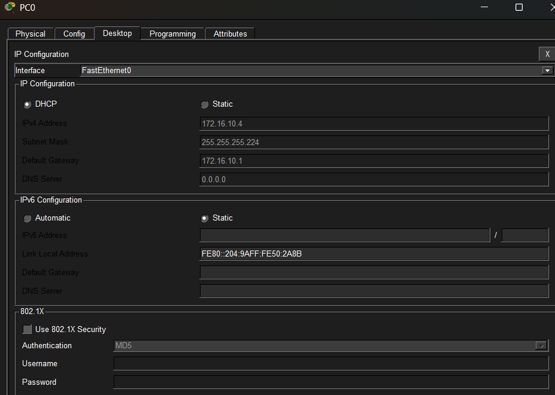
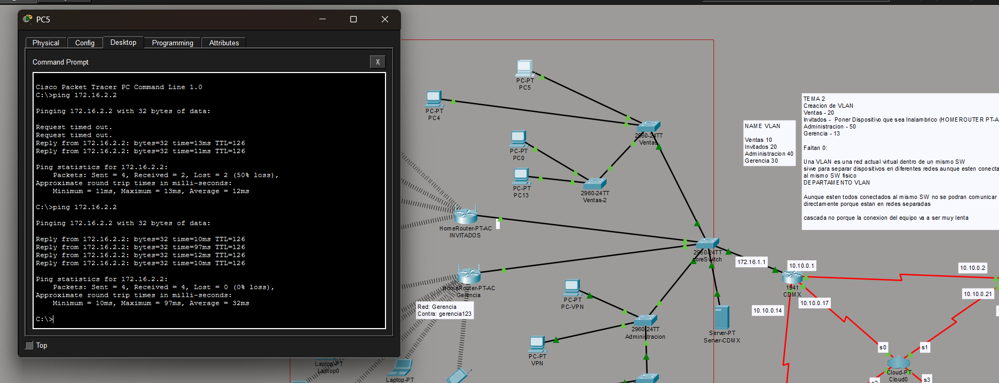
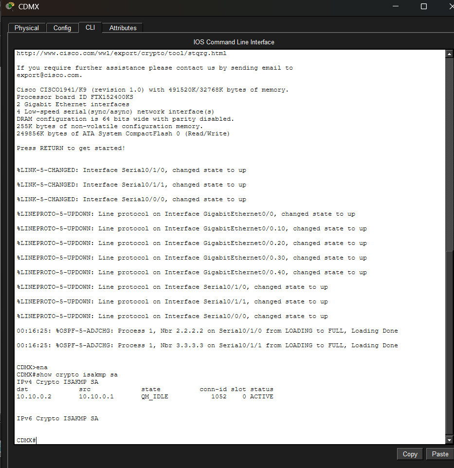

# 02 - Enterprise Network Lab

Simulación de red empresarial con 4 sucursales basada en Starbucks México.
Implementada en Cisco Packet Tracer.

## Tecnologías implementadas
- VLANs y Trunks (802.1Q)
- OSPF (enrutamiento dinámico)
- WAN con enlaces seriales /30
- Frame Relay
- DHCP con subinterfaces (Router-on-a-Stick)
- VPN IPSec sitio a sitio (CDMX ↔ GDL)
- Conectividad a la nube

## Topología

## Sucursales
| Sucursal | Red LAN | Red WAN |
|---|---|---|
| Ciudad de México | 172.16.1.0/24 | 10.10.0.17/30 |
| Guadalajara | 172.16.2.0/24 | 10.10.0.21/30 |
| Monterrey | 172.16.3.0/24 | 10.10.0.25/30 |
| Cancún | 172.16.4.0/24 | 10.10.0.29/30 |

## VLANs
| VLAN ID | Departamento | Prefijo | Máscara | Usuarios |
|---|---|---|---|---|
| 10 | Ventas | /27 | 255.255.255.224 | 20 |
| 20 | Invitados | /28 | 255.255.255.240 | 13 |
| 30 | Gerencia | /28 | 255.255.255.240 | 13 |
| 40 | Administración | /26 | 255.255.255.192 | 50 |

## Evidencias

### DHCP funcionando

### Ping entre sucursales

### VPN activa

## Configuración completa
Ver archivo [configuracion.md](configuracion.md)
